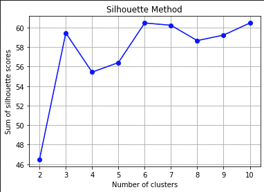
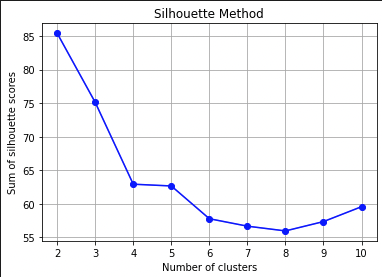

# Spotify Joint Playlist Project

Created an app that will create a joint playlist between two users on Spotify, creating a playlist with songs that both people should enjoy.

Link to a walkthrough of the website: https://youtu.be/MVTnEEGDoyo

## Prerequisites

- Python (version 3.6 or above) installed on your system
- pip package manager

## Configuration

<u>Install Dependencies<u>
- pip install flask spotipy pandas numpy umap scikit-learn

Setup variables
- Setup SPOTIPY_CLIENT_ID and SPOTIPY_CLIENT_SECRET in a config.py file with your own Spotify client credentials

## Project Overview

This project uses the Spotify API to retrieve user data on short, medium, and long-term songs that they listen to. The goal of the project is to recommend the most fitting songs from one user's library to the other user. The recommendation process involves comparing song metrics obtained from the Spotify API, as well as comparing the genres associated with each song to a user's overall genres.

The main objectives of the project are as follows:

- Retrieve user data on short, medium, and long term songs from the Spotify API.
- Compare song metrics, such as acousticness, energy, etc.
- Compare the genres associated with each song to the user's overall genres.
- Generate recommendations based on the comparison results.
- Creates a playlist for the user on Spotify and gives some insight into how the songs were chosen.

## Data Collection and Preproccessing

- Setup Spotify API
- Extract neccesary data from dicitionaries
  - Example dictionary for a song: {
    "album": {
        "album_type": "ALBUM",
        "artists": [{
            "external_urls": {
                "spotify": "https://open.spotify.com/artist/ID"
            },
            "name": "Slum Village",
            ...
        }],
        "available_markets": ["AD", "AE", ...],
        "external_urls": {
            "spotify": "https://open.spotify.com/album/ID"
        },
        "images": [{
            "url": "https://i.scdn.co/image/IMAGE_ID",
            ...
        }],
        "name": "Detroit Deli (A Taste Of Detroit)",
        ...
    },
    "artists": [{
        "external_urls": {
            "spotify": "https://open.spotify.com/artist/ID"
        },
        "name": "Slum Village",
        ...
    }, ...],
    "available_markets": ["AD", "AE", ...],
    "duration_ms": 225400,
    "explicit": true,
    "external_ids": {
        "isrc": "USCA20400008"
    },
    "external_urls": {
        "spotify": "https://open.spotify.com/track/ID"
    },
    ...
}

-Final dataframe, added score to signify how much the user likes the song

## Songs that one user likes that the other would like

### Song Metrics
-Scaled song metrics
-UMAP dimensionality reduction on features

-KMeans clustering and Silhoutte Method to determine optimal number

### Genres
